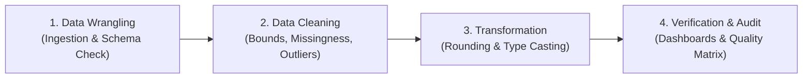

# Water Potability Data Cleaning & Quality Assurance

A domain-informed exploratory data analysis and data cleaning pipeline for municipal drinking water safety, benchmarked against World Health Organization (WHO) standards.

```{admonition} Laboratory Project Information
:class: tip
* **Course:** DS311 - Exploratory Data Analysis (EDA)
* **Project:** Laboratory Activity 1 - Chemical Safety & Quality Assessment
* **Topic:** Environmental Health & Public Safety (UN Sustainable Development Goal 6: Clean Water and Sanitation)
* **Dataset Source:** [Water Potability Dataset on Kaggle](https://www.kaggle.com/datasets/adityakadiwal/water-potability) by Aditya Kadiwal
* **Dataset Scope:** 3,276 water samples tested across 9 physicochemical water quality parameters
* **Target Classification:** `Potability` (1 = Safe / Potable, 0 = Unsafe / Non-potable)
```

---

## 1. Project Background & Problem Formulation

Access to safe, uncontaminated drinking water is essential to public health and disease prevention. Municipal water utilities, environmental agencies, and water treatment plants continuously monitor physicochemical indicators such as **acidity (pH)**, **disinfection residuals (chloramines)**, **dissolved minerals**, and **clarity (turbidity)** to evaluate water safety.

This project evaluates the [Kaggle Water Potability Dataset](https://www.kaggle.com/datasets/adityakadiwal/water-potability) compiled by Aditya Kadiwal, containing real-world physicochemical metrics from 3,276 water bodies benchmarked against World Health Organization (WHO) guidelines.

### The Real-World Engineering Challenge
Raw sensor logs and chemical assay records from environmental sampling frequently suffer from three critical data quality defects:
1. **Pervasive Missingness:** Incomplete laboratory assays due to testing costs or sensor limits affecting **38.61% of all samples (1,265 rows)**.
2. **Physical Boundary Violations:** Uncalibrated sensor voltage generating impossible readings (e.g., negative pH or values exceeding 14).
3. **Extreme Mineral Spikes:** Skewed distributions where natural mineral-rich groundwater reaches tens of thousands of ppm, requiring careful handling so authentic samples are not wrongly pruned.

Our objective is to engineer an **end-to-end Python data cleaning pipeline** that remediates all anomalies, preserves 100% of authentic water samples, and produces an audited, analysis-ready dataset.

---

## 2. Dataset Codebook & Physicochemical Parameters

The dataset contains 9 continuous water quality metrics and 1 binary potability label. Below is the complete parameter codebook with everyday explanations and WHO health standards:

| Column Name | Metric / Unit | Everyday Explanation | WHO Safe Drinking Limit | Health & Practical Implication |
| :--- | :--- | :--- | :--- | :--- |
| `ph` | **pH (0-14 scale)** | Measures how acidic or basic the water is. Pure water is 7.0. | **6.5 to 8.5** | Below 6.5 corrodes pipes and leaches heavy metals; above 8.5 causes mineral scaling and bitter taste. |
| `Hardness` | **Hardness (mg/L)** | Dissolved calcium and magnesium minerals from rock formations. | *No strict health limit* (typically < 200 mg/L) | High hardness prevents soap lathering and causes limescale deposits in plumbing and boilers. |
| `Solids` | **TDS (ppm)** | Total Dissolved Solids: all inorganic salts and minerals dissolved in water. | **< 500 to 1,000 ppm** | High TDS imparts an earthy or salty taste; natural mineral aquifers can reach extreme levels. |
| `Chloramines` | **Chloramines (ppm)** | Chlorine and ammonia compound added to municipal water to disinfect pathogens. | **Up to 4.0 ppm** | Essential disinfectant residual; levels above 4.0 ppm cause respiratory irritation and eye irritation. |
| `Sulfate` | **Sulfate (mg/L)** | Naturally occurring dissolved minerals from soil and rock erosion. | **< 250 mg/L** | Concentrations above 250 mg/L produce a bitter taste and can exert a laxative effect on consumers. |
| `Conductivity` | **Conductivity ($\mu$S/cm)** | Electrical conductivity: measures how well electrical current flows through water. | **< 400 $\mu$S/cm** | High conductivity indicates elevated dissolved ionic minerals and salinity. |
| `Organic_carbon` | **TOC (ppm)** | Total Organic Carbon: broken-down decaying plant and organic material. | **< 2.0 to 4.0 ppm** | High TOC reacts with chlorine disinfectants to form potentially toxic disinfection byproducts. |
| `Trihalomethanes` | **THMs ($\mu$g/L)** | Chemical disinfection byproducts formed when chlorine reacts with organic matter. | **< 80 $\mu$g/L** | Chronic long-term exposure to elevated THMs has been associated with cancer risk and liver damage. |
| `Turbidity` | **Turbidity (NTU)** | Cloudiness or haziness caused by suspended particles and sediment. | **< 5.0 NTU** (ideal < 1.0) | High turbidity shields pathogenic microorganisms from disinfection treatments. |
| `Potability` | **Binary Target** | Final safety classification of the water sample. | `1` = Potable / Safe, `0` = Unsafe | Target variable evaluated against physicochemical indicators. |

---

## 3. The 4 Stages of Data Preparation

Our data preparation workflow follows a structured, standard methodology:



| Stage | Process Description | Pipeline Implementation |
| :--- | :--- | :--- |
| **1. Data Wrangling** | Ingesting raw CSV files and performing schema and duplicate checks. | Loaded `water_potability.csv` (3,276 rows x 10 cols); verified 0 duplicate rows. |
| **2. Data Cleaning** | Resolving sensor boundary violations, missing values, and outliers. | Applied pH physical bounding $[0, 14]$, class-conditional group median imputation, and $3.0 \times \text{IQR}$ extreme outlier filtering. |
| **3. Data Transformation** | Standardizing data precision and feature encodings. | Rounded all 9 continuous floats to 3 decimal places; cast `Potability` to `int64`. |
| **4. Verification & Audit** | Comparing pre- and post-cleaning metrics and exporting clean data. | Validated 0 missing values, 100% sample retention (3,276/3,276), and saved to `data/processed/water_potability_cleaned.csv`. |

```{admonition} Core Engineering Principle
:class: important
*"Never discard authentic data simply because it deviates from standard Gaussian assumptions. Distinguish between physical sensor failure and legitimate environmental variance before applying transformations."*
```

---

## 4. Jupyter Book Roadmap & Navigation

This interactive book is organized into **3 core pages**:

````{grid} 1 2 3 3
```{grid-item-card} 1. Project Overview & Codebook
:link: ./index.md
**Landing Page**
Executive overview, domain background, complete physicochemical codebook, and WHO drinking safety standards.
```

```{grid-item-card} 2. Data Cleaning Pipeline
:link: ../notebooks/presentation.ipynb
**Interactive Notebook**
Full Python implementation, missingness matrix, MCAR/MAR diagnostics, benchmark comparisons, and before-vs-after audit dashboards.
```

```{grid-item-card} 3. Defense & Q&A Guide
:link: ./03_defense_guide.md
**Oral Defense Guide**
13 comprehensive questions with two-tier answers (Simple Spoken vs. Technical Rationale) and presentation cheat sheet.
```
````

---

## 5. Summary Quality Audit

| Diagnostic Check | Raw Dataset (Before) | Pipeline Action | Cleaned Dataset (After) | Status |
| :--- | :--- | :--- | :--- | :--- |
| **Sample Retention** | 3,276 samples | Domain-informed filtering | **3,276 samples (100.0%)** | Preserved |
| **Total Missing Values** | 1,434 missing across 3 features | Class-conditional median imputation | **0 missing values (0.0%)** | Resolved |
| **pH Physical Range** | Sensor errors outside $[0, 14]$ | Replaced invalid with NaN and imputed | Strictly within **$[0.00, 14.00]$** | Validated |
| **Mineral Outliers (Solids)** | 47 samples flagged by $1.5	imes	ext{IQR}$ | Extreme fence ($$3.0 \times \text{IQR}$ = 62,331	ext{ ppm}$) | **0 authentic samples deleted** | Preserved |
| **Numeric Precision** | Inconsistent decimal places | Precision standardization | **Standardized 3 decimals** | Cleaned |

---

## References & Attribution

1. **Dataset Source:** Kadiwal, Aditya. *Water Potability: Drinking Water Quality Dataset*. Available on Kaggle: [https://www.kaggle.com/datasets/adityakadiwal/water-potability](https://www.kaggle.com/datasets/adityakadiwal/water-potability).
2. **International Benchmark:** World Health Organization (WHO). *Guidelines for Drinking-water Quality (4th Edition)*, Geneva: World Health Organization.
3. **Sustainable Development Goals:** United Nations Department of Economic and Social Affairs. *Goal 6: Ensure availability and sustainable management of water and sanitation for all*.
